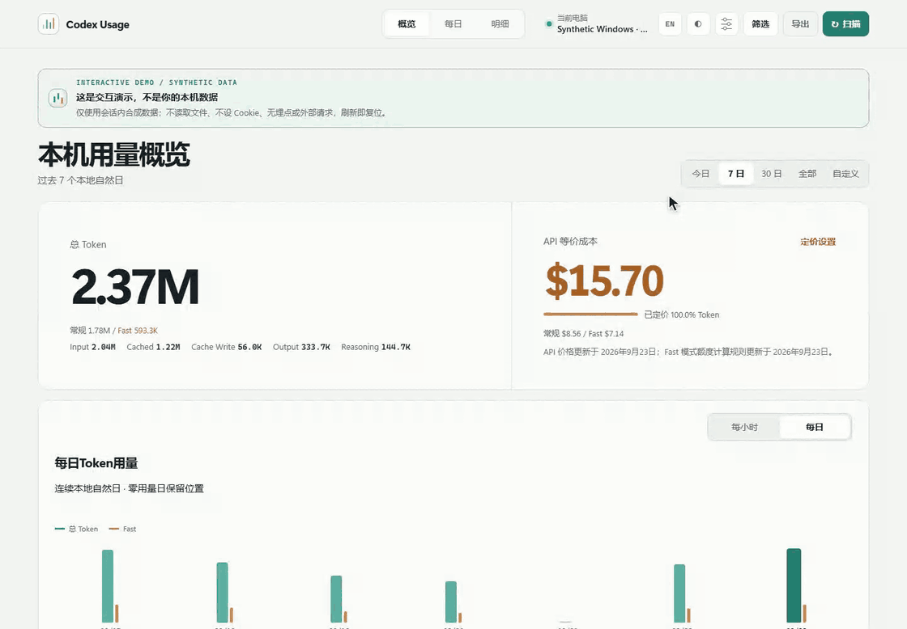
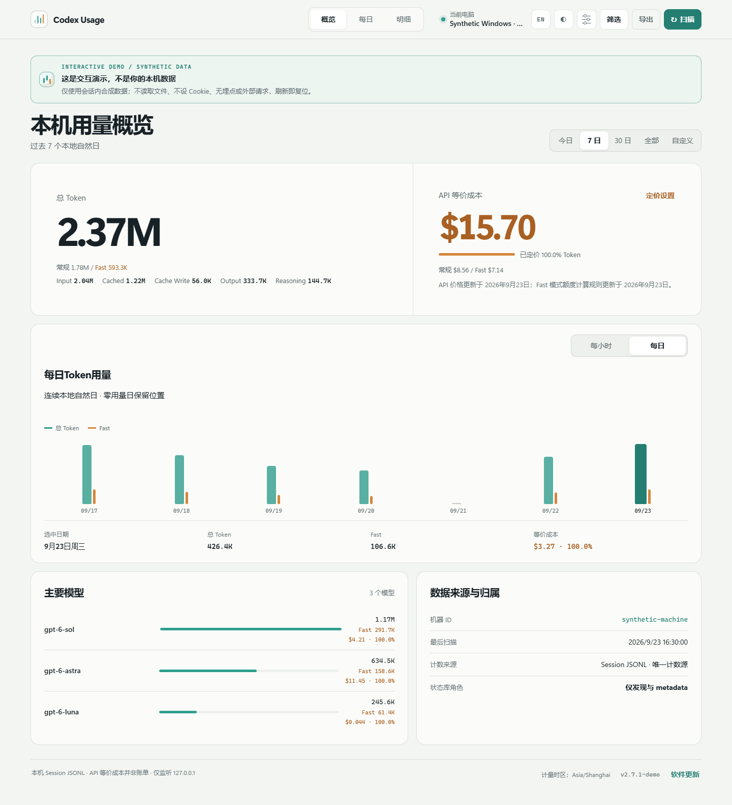
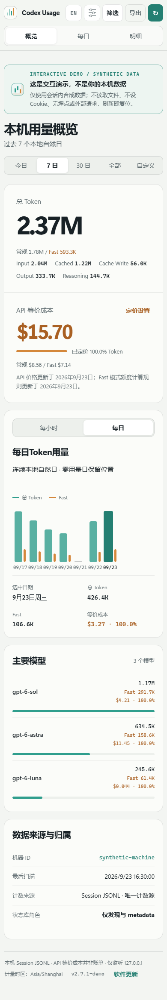
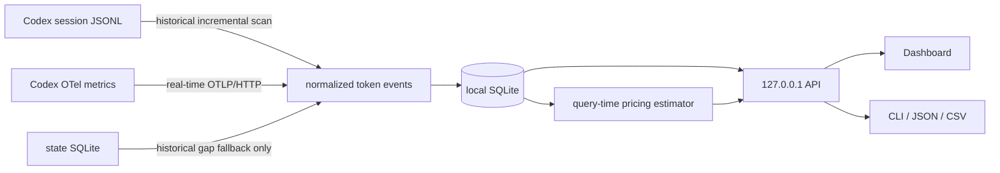

<div align="center">

# codex-usage

**Which machine, model, project, or session used your Codex tokens?**

*本地优先的 Codex 使用分析：从逐电脑归属，到模型、项目、会话与 API 等价成本。*

[Live Demo](https://zjay26.github.io/codex-usage/?lang=en) · [Windows x64](https://github.com/zJay26/codex-usage/releases/latest/download/codex-usage-windows-amd64.exe) · [Linux x64](https://github.com/zJay26/codex-usage/releases/latest/download/codex-usage-linux-amd64) · English / [简体中文](README.md)

[](https://github.com/zJay26/codex-usage/actions/workflows/ci.yml)
[](https://github.com/zJay26/codex-usage/releases/latest)
[](https://go.dev/)
[](LICENSE)

</div>



> The animation and Live Demo use synthetic data only. They do not read your files, set cookies, run analytics, or make external requests.

## Understand it in 30 seconds

Run one single-file binary on each Windows, WSL, or Linux host. It scans that machine's historical Codex JSONL and receives future usage over loopback OTel. Coverage-aware merge rules deduplicate the two sources, and the result stays in that machine's SQLite database. The Dashboard therefore answers **how much this computer used**, not how much the whole account used.

Per-machine attribution is codex-usage's most distinctive entry point, but it is not the endpoint. It breaks the local total down by model and token category, project, Thread, Session, Agent, and local calendar day, then adds Standard API-equivalent cost, pricing coverage, and data-quality records.

Codex's official [`/usage`](https://learn.chatgpt.com/docs/developer-commands.md?surface=cli) is useful for daily, weekly, and cumulative account token activity. codex-usage complements that account view with an explainable local attribution layer: **where these machine-local tokens came from and what drove them**.

The analysis stays local-first: one binary, loopback-only services, local SQLite, and **no access to `auth.json` or conversation content**.

## From totals to explainable usage analytics

| Question | What codex-usage shows |
|---|---|
| Which machine used the tokens? | An independent ledger for each Windows, WSL, or Linux host |
| Which models and token categories drove usage? | Model plus Input, Cached, Cache Write, Output, and Reasoning composition |
| Which work drove it? | Project, Thread, Session, and main task / Subagent / Guardian / Memory attribution |
| When did it happen? | Today, 7 days, 30 days, all time, local calendar days, and single-day drill-down |
| What would it roughly cost at API rates? | Standard API-equivalent cost with explicit token pricing coverage |
| Can the number be audited? | JSONL / OTel provenance, coverage-aware deduplication, unattributed deltas, and data-quality records |

## What it counts / what it does not count

| Counts | Does not count or read |
|---|---|
| Tokens, models, sources, projects, Threads, Sessions, Agents, and local calendar days on this machine | Usage from other machines on the account |
| Historical session JSONL and future `turn.token_usage` OTel metrics | Account quota, subscription balance, or real bills |
| Standard API text-token equivalent cost and pricing coverage | Prompts, replies, reasoning, tool output, or `auth.json` |
| Dedup records, coverage gaps, and historical deltas without dates | Cloud sync, remote telemetry, or third-party analytics |

> “Machine” means the host running the Codex client and collector, not a remote target used by a shell or tool. Cost is an equivalent estimate, never an OpenAI bill.

## Install directly

Windows amd64 / x64 (no administrator privileges required):

```powershell
Invoke-WebRequest https://github.com/zJay26/codex-usage/releases/latest/download/codex-usage-windows-amd64.exe -OutFile codex-usage.exe
.\codex-usage.exe --lang en install
```

Linux amd64 / x64:

```bash
curl -fL https://github.com/zJay26/codex-usage/releases/latest/download/codex-usage-linux-amd64 -o codex-usage
chmod +x codex-usage
./codex-usage --lang en install
```

Need arm64? Download `windows-arm64.exe` or `linux-arm64` from the [latest Release](https://github.com/zJay26/codex-usage/releases/latest). Verify the file against `SHA256SUMS` on the same page.

The installer creates the local database, scans historical sessions, safely adds a loopback OTel endpoint, and starts a user-level background service. It never overwrites a third-party metrics exporter. Restart Codex when convenient so new processes load live collection, then run `codex-usage` to open the Dashboard.

On a headless Linux server, Codex Usage prints an SSH tunnel command. Run it from your own computer, then open `http://127.0.0.1:43189`.

## Highlights

| Capability | What you get |
|---|---|
| Signature per-machine attribution | A separate `machine_id` and SQLite database on every host |
| Historical + live | Scan existing JSONL first, then receive official OTel metrics |
| Deduplication | Merge OTel, JSONL, and state data by explicit coverage rules instead of summing them |
| Daily drill-down | Continuous daily pulse, calendar, zero-usage days, and per-day model mix |
| Multi-dimensional usage analytics | Understand usage by model, token category, source, project, Thread, Session, main task, Subagent, Guardian, or Memory |
| Cost insight | Query-time Standard API-equivalent estimate with visible token pricing coverage; unknown usage never looks free |
| Auditable quality | Visible provenance, dedup records, coverage gaps, and historical deltas without dates |
| Local-first | Loopback-only at `127.0.0.1`, embedded assets, and no runtime external requests |
| Single binary | Windows/Linux, amd64/arm64, no CGO or external database service |
| Bilingual | Dashboard and CLI support `zh-CN` / `en` through URL, button, flag, and environment |

<details><summary>View static desktop and 390 × 844 mobile screenshots</summary>





</details>

## How it works

`codex-usage` is one Go binary containing the collector, SQLite store, local API, and Web Dashboard.



### Historical scan

The tool reads the current machine's `CODEX_HOME`. It first discovers canonical session metadata from the Codex state database, then streams JSONL files under `sessions/` and `archived_sessions/`.

Codex session usage is cumulative. At **each** `token_count` record, the scanner subtracts the previous cumulative vector and assigns that delta to the record timestamp's local calendar day. It never moves an entire multi-day session to the session's latest update date. Stable event IDs and cursors keep repeated scans idempotent. Large prompt, response, reasoning, and tool-output records are skipped without loading the entire line into memory or writing content to the database.

State-database differences that have only an aggregate total and no event timestamp remain date-unattributed. They appear only in the all-time total and are never guessed or spread across days. OpenAI's [`account/usage/read`](https://learn.chatgpt.com/docs/app-server#7-token-usage-chatgpt) returns service-backed ChatGPT account token activity and optional daily buckets; this tool uses only current-machine local sources, so the scopes differ, and the public documentation does not define those account buckets as using the same local-calendar timezone.

### Real-time collection

The installer safely configures Codex to send official `turn.token_usage` metrics to:

```text
http://127.0.0.1:43189/v1/metrics
```

The receiver accepts OTLP/HTTP JSON on loopback only. It never exposes a public listener.

### Merge rules

- OTel is the machine total during known OTel coverage windows
- session JSONL fills time before OTel was enabled or while the receiver was offline
- state-database `tokens_used` only fills historical differences that cannot be assigned to a date
- project, thread, and session details are attribution views and are not added again to the machine total

The three sources are never blindly summed.

Repeated data-quality records are grouped by kind and local path while retaining first seen, last seen, and occurrence count. `state_fallback_suppressed_otel` means the de-duplication guard successfully prevented a state total from being added on top of OTel, so it remains informational rather than actionable. Cumulative resets, malformed records, and invalid timestamps remain visible for review.

### Local service

The service scans once on startup and then incrementally every 60 seconds by default. The Dashboard and CLI query the same local SQLite database. There is no central server or cross-machine sync.

The Dashboard has three first-level views: Overview, Daily, and Details. Overview defaults to the last seven local calendar days. Daily fills zero-usage dates and supports calendar drill-down. Details shows one attribution dimension—model, source, agent, project, or thread—at a time.

### Standard API-equivalent cost

The estimator streams the normalized events that already passed source de-duplication and attribution filtering. It runs at query time, writes no cost data to SQLite, and leaves existing token totals unchanged. Arithmetic uses fixed-point nano-USD. Cached Input and Cache Write are removed from regular Input, and Reasoning is already included in Output, so neither is charged twice.

Bundled Standard text prices were checked on **2026-07-31**. All values are USD / 1M tokens:

| Model | Input | Cached | Cache Write | Output |
|---|---:|---:|---:|---:|
| [GPT-5.6 Sol](https://developers.openai.com/api/docs/models/gpt-5.6-sol) | 5.00 | 0.50 | 6.25 | 30.00 |
| [GPT-5.6 Terra](https://developers.openai.com/api/docs/models/gpt-5.6-terra) | 2.00 | 0.20 | 2.50 | 12.00 |
| [GPT-5.6 Luna](https://developers.openai.com/api/docs/models/gpt-5.6-luna) | 0.20 | 0.02 | 0.25 | 1.20 |
| [GPT-5.5](https://developers.openai.com/api/docs/models/gpt-5.5) | 5.00 | 0.50 | not published | 30.00 |
| [GPT-5.4](https://developers.openai.com/api/docs/models/gpt-5.4) | 2.50 | 0.25 | not published | 15.00 |
| [GPT-5.4 mini](https://developers.openai.com/api/docs/models/gpt-5.4-mini) | 0.75 | 0.075 | not published | 4.50 |
| [GPT-5.3-Codex](https://developers.openai.com/api/docs/models/gpt-5.3-codex) | 1.75 | 0.175 | not published | 14.00 |
| [GPT-5.2-Codex](https://developers.openai.com/api/docs/models/gpt-5.2-codex) | 1.75 | 0.175 | not published | 14.00 |

GPT-5.6 Cache Write uses the official 1.25× regular Input rule. Exact GPT-5.4, GPT-5.5, and GPT-5.6 events apply the long-context multipliers when Input exceeds 272K. Aggregate-only records and events whose request boundary cannot be established remain unpriced. The UI always shows estimated cost together with token pricing coverage; unknown models are never treated as zero-cost.

Internal models can be explicitly mapped to one built-in public model or assigned custom rates in the Dashboard. Overrides take effect without restarting:

```json
{
  "pricing_overrides": {
    "codex-auto-review": { "alias_of": "gpt-5.6-luna" },
    "internal-model": {
      "input_usd_per_million": "1.00",
      "cached_input_usd_per_million": "0.10",
      "cache_write_input_usd_per_million": "1.25",
      "output_usd_per_million": "6.00"
    }
  }
}
```

The loopback API exposes `GET /api/v1/cost-estimate`, `GET /api/v1/pricing`, and `PUT /api/v1/pricing/overrides`. Pricing ships inside the binary; the running app never fetches price pages.

## Common commands

```text
codex-usage                         Open the Dashboard
codex-usage summary --since 7d     Show a 7-day summary
codex-usage summary --since 30d --json
codex-usage summary --since all --csv
codex-usage scan                    Incremental historical scan
codex-usage scan --rebuild          Rebuild historical scan data
codex-usage doctor                  Check paths, service, and coverage gaps
codex-usage config add-home PATH    Add another CODEX_HOME
codex-usage uninstall               Remove the app, keep the database
codex-usage uninstall --purge       Remove the app and local data
```

The Dashboard supports `?lang=en|zh-CN` and its header language button. The URL wins over the saved locale, followed by the browser locale. The CLI supports global `--lang` and `CODEX_USAGE_LANG`, for example `CODEX_USAGE_LANG=en codex-usage doctor`. `--json` and `--csv` fields never change with language.

## Local data paths

| Data | Windows | Linux |
|---|---|---|
| Codex Home | `%USERPROFILE%\.codex` | `~/.codex` |
| codex-usage state | `%LOCALAPPDATA%\codex-usage` | `${XDG_DATA_HOME:-~/.local/share}/codex-usage` |
| Installed binary | `%LOCALAPPDATA%\Programs\codex-usage\codex-usage.exe` | `~/.local/bin/codex-usage` |
| SQLite | `...\codex-usage\usage.sqlite` | `.../codex-usage/usage.sqlite` |

`CODEX_USAGE_HOME` overrides the app state directory. Do not synchronize this directory between machines, or the per-machine boundary becomes unreliable.

`usage.sqlite` is created automatically when installation, service startup, scanning, or a query first opens the store, then persists in the state directory above. The embedded pure-Go SQLite driver requires no separately installed SQLite server, Python, Docker, or CGO. The current user only needs write access to the state directory and sufficient disk space. Prefer a local disk; do not place the active database on cloud-sync folders, network shares, or a directory written by multiple machines.

## Privacy boundaries

- never reads or parses `auth.json`
- never stores prompts, responses, reasoning, or tool output
- never stores a Codex account ID
- uses no CDN; frontend assets are embedded
- refuses to listen outside `127.0.0.1`
- never reads actual OpenAI billing or ChatGPT rate-limit/account quota; it only estimates Standard API-equivalent cost for this machine
- embeds its pricing catalog and makes no external network request for estimation

Full local project paths and thread titles are retained for attribution, so JSON/CSV exports may contain that local metadata.

## Build from source

Go 1.26.x is required:

```bash
go test ./...
CGO_ENABLED=0 go build -trimpath -o codex-usage ./cmd/codex-usage
```

Build all four targets with `scripts/build.ps1` on Windows or `scripts/build.sh` on Linux.

Dashboard tests:

```bash
npm ci
npx playwright install chromium
go build -trimpath -o codex-usage ./cmd/codex-usage
CODEX_USAGE_BIN=./codex-usage npm test
```

See [ACCEPTANCE.md](ACCEPTANCE.md) for validation results, [CONTRIBUTING.md](CONTRIBUTING.md) before opening an issue, and [SECURITY.md](SECURITY.md) for private vulnerability reporting.

## Known boundaries

- v1 does not aggregate multiple machines; open each machine's Dashboard separately
- Codex OTel may omit thread IDs or cwd, so exact totals can coexist with JSONL-based attribution
- historical sessions cannot be reliably split after users synchronize one Codex Home across machines
- Codex `total` is displayed as reported; it is not an actual bill or account-quota measurement, and API-equivalent cost is only a current-price conversion of local tokens

## License

[MIT](LICENSE) © Codex Usage contributors
