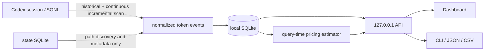

<div align="center">

# codex-usage

**Which machine, model, project, or session used your Codex tokens?**

*See local Codex usage by machine, model, project, and session—with API-equivalent cost estimates.*

[Live Demo](https://zjay26.github.io/codex-usage/?lang=en) · [Windows x64](https://github.com/zJay26/codex-usage/releases/latest/download/codex-usage-windows-amd64.exe) · [Linux x64](https://github.com/zJay26/codex-usage/releases/latest/download/codex-usage-linux-amd64) · English / [简体中文](README.md)

[](https://github.com/zJay26/codex-usage/actions/workflows/ci.yml)
[](https://github.com/zJay26/codex-usage/releases/latest)
[](https://go.dev/)
[](LICENSE)

</div>


> The animation and Live Demo use synthetic data only. They do not read your files, set cookies, run analytics, or make external requests.

## Understand it in 30 seconds

If you use Codex on more than one computer, an account total cannot tell you **which machine, project, model, or Session used the tokens**. codex-usage fills in that local detail.

Install it once on each computer, then open the Dashboard in your browser to see totals, daily trends, models, projects, and Sessions. Session details are searchable and include an API-equivalent cost estimate. New local usage appears automatically.

All statistics stay on the current computer. codex-usage never stores prompts, replies, or tool output, and does not read `auth.json`. It extracts only usage and mode metadata, skipping conversation strings in diagnostic records. Cost is an estimate based on public API rates and Fast credit multipliers, not an OpenAI bill or account quota.

## Install directly

Windows amd64 / x64 (no administrator privileges required):

```powershell
Invoke-WebRequest https://github.com/zJay26/codex-usage/releases/latest/download/codex-usage-windows-amd64.exe -OutFile codex-usage.exe
.\codex-usage.exe --lang en install
```

Linux amd64 / x64:

```bash
curl -fL https://github.com/zJay26/codex-usage/releases/latest/download/codex-usage-linux-amd64 -o codex-usage
chmod +x codex-usage
./codex-usage --lang en install
```

macOS (Apple Silicon; use `amd64` on Intel):

```bash
curl -fL https://github.com/zJay26/codex-usage/releases/latest/download/codex-usage-darwin-arm64 -o codex-usage
chmod +x codex-usage
./codex-usage install
```

Installs a per-user login LaunchAgent without `sudo`. See [macOS installation](docs/macos.md) for checksums, locations and opening the unnotarized binary.

Need arm64? Download `windows-arm64.exe` or `linux-arm64` from the [latest Release](https://github.com/zJay26/codex-usage/releases/latest). Verify the file against `SHA256SUMS` on the same page.

The installer finds existing Codex usage on this computer and keeps the Dashboard updated in the background. Run `codex-usage` to open it.

Starting with **v2.5.0**, the application checks GitHub for the latest stable release every six hours by default. Updates are optional: open **Software updates** in the footer to review release notes, disable automatic checks, or check manually. Only **Download and update** downloads the release, verifies SHA256, backs up the program and local statistics, and replaces and restarts the application. A startup failure triggers an attempt to restore the previous program and data. Backups remain under `.codex-usage-updates/run-*` in the state directory.

**Older versions need one manual download and `install` before in-app updates become available.** Portable and preview copies only offer version checks and the release page. Checks fetch version information from GitHub, downloads come from this project's Release assets, and neither uploads usage, paths, or conversations. Turning off automatic checks stops background update requests. Re-running `install` remains available for manual upgrades.

On a headless Linux server, Codex Usage prints an SSH tunnel command. Run it from your own computer, then open `http://127.0.0.1:43189`.

## What you can see

| Question | What codex-usage shows |
|---|---|
| Which machine used the tokens? | Separate statistics for each Windows, WSL, Linux, or macOS host, without mixing in other computers on the account |
| Which models and token categories drove usage? | Model plus Input, Cached, Cache Write, Output, and Reasoning composition |
| Which work drove it? | Project, Thread, Session, and main task, Subagent, Guardian, or Memory attribution |
| When did it happen? | Today, 7 days, 30 days, all time, and single-day details |
| What did one Session use? | Session-level tokens and API-equivalent cost, with search and a one-click “Only this Session” filter |
| What would all of this roughly cost at API rates? | Overall and itemized API-equivalent cost, plus explicit pricing coverage |

## Highlights

| Capability | What you get |
|---|---|
| Per-machine attribution | Keep work, home, Windows, WSL, and Linux usage clearly separated |
| History and incremental scans | Find existing records after installation and add new local usage automatically |
| Optional software updates | Check and notify automatically; download and install only when chosen, with an opt-out for automatic checks |
| Total and Fast | Keep total tokens prominent, show regular / Fast beneath the overview, and show total plus Fast in trends, models, and sessions |
| Main tasks and subtasks | Collapse explicit parent/child links; compare own and subtree usage while costs remain own-only |
| Session search and filters | Search by Thread, Session ID, project, model, or source; click an active quick filter again to clear it |
| Daily drill-down | Explore trends, calendar days, zero-usage days, and any day's model mix |
| Multi-dimensional details | Understand usage by model, token category, source, project, Thread, Session, and Agent |
| Equivalent cost | See API-equivalent cost overall and per Session; unpriced usage is clearly marked instead of looking free |
| Local and private | Keep data on the current computer, with no conversation uploads or central server |
| Lightweight install | One file for Windows / Linux / macOS and amd64 / arm64, with no separate database to install |
| Bilingual | Switch the Dashboard and CLI between English and Simplified Chinese |

## Scope and boundaries

| Counts | Does not count or store |
|---|---|
| Tokens, models, sources, projects, Threads, Sessions, Agents, and calendar days on this machine | Usage from other machines on the account |
| Existing and newly added local Codex session usage | Account quota, subscription balance, or real bills |
| API-equivalent cost using Standard text rates and Fast credit multipliers, plus pricing coverage | Prompts, replies, reasoning content, tool output, or `auth.json` |
| Data-quality notices for duplicates, resets, malformed records, and rebuilds | Cloud sync, remote telemetry, or third-party analytics |

> “Machine” means the host running Codex and codex-usage, not a remote target used by a shell or tool. Codex's official `/usage` shows account-level activity; codex-usage adds detailed attribution for the current computer.

<details><summary>View static desktop and 390 × 844 mobile screenshots</summary>


</details>

## How it works: technical details

`codex-usage` is one Go binary containing the JSONL scanner, SQLite store, local API, and Web Dashboard.

During an upgrade, the installer removes only a legacy OTel exporter marked by codex-usage itself. It never rewrites third-party exporters, and Codex does not need to restart.



### Historical scan

The tool reads the current machine's `CODEX_HOME`. It first discovers canonical session metadata from the Codex state database, then streams JSONL files under `sessions/` and `archived_sessions/`.

Token records can be cumulative per session or per turn. Persisted scope and the last token turn distinguish them: total equal to last at a new turn establishes turn scope even when it equals or exceeds the preceding total. Legacy session counters retain their cross-turn baseline. At **each** `token_count` record, the scanner subtracts the previous cumulative vector and assigns that delta to the record timestamp's local calendar day. It never moves an entire multi-day session to the session's latest update date. Stable event IDs and cursors keep repeated scans idempotent. Large prompt, response, reasoning, and tool-output records are skipped without loading the entire line into memory or writing content to the database.

The Codex state database is used only to discover rollout paths and enrich titles, projects, and other metadata. Its `tokens_used` value never changes token totals. OpenAI's [`account/usage/read`](https://learn.chatgpt.com/docs/app-server#7-token-usage-chatgpt) is service-backed account activity; this tool counts only current-machine local JSONL, so the scopes differ.

### JSONL deduplication and fork ownership

- The first `session_meta` fixes the owner session of a physical JSONL file; a copied parent `session_meta` cannot overwrite it.
- In a `forked_from_id` rollout, the “child metadata → copied parent snapshots → parent metadata” prefix establishes a cumulative baseline but is not counted as new child usage.
- Session counters use a high-water mark; turn counters deduplicate stable session/turn snapshot identities. A pre-upgrade session in a newly restored physical file requests a rebuild when old identities cannot safely prove the replay boundary.
- If a same-total snapshot corrects Cached Input, Cache Write, Reasoning, or another category, the original event is corrected instead of treating the snapshot as a duplicate.

### File and calendar stability

Every scan unions paths from the state database with `sessions/` and `archived_sessions/`, so a missing state row cannot hide a JSONL file. Ordinary Windows paths and `\\?\` extended paths normalize to one file. Truncation, a rewrite inside the scanned range, a newly completed fork-replay boundary, or a parser upgrade preserves the current statistics and requests a rebuild. Derived indexes are cleared only after confirmation in the Dashboard or an explicit `codex-usage scan --rebuild`, then rebuilt from the JSONL files that still exist. Data from deleted JSONL files may no longer be recoverable at that point.

An IANA accounting time zone is persisted in the database and shown in the footer. All processes and remote browsers use it. Events keep calendar dates and actual UTC hour identities, including repeated DST hours. Set `CODEX_USAGE_TIMEZONE` before creating a new database to choose its zone; subsequent environment changes do not change the saved zone. Newer Codex writers restart cumulative values at the beginning of a new turn; when that value exactly matches `last_token_usage`, the scanner treats it as an exact increment instead of a data-quality warning. Cumulative boundaries that cannot be fully verified, malformed records, invalid timestamps, and pending rebuilds remain visible. Stale file-rewrite or truncation warnings are removed after a later scan proves that the path has recovered.

Events, modes, counter progress and file offsets commit atomically per file. Database failures roll back and retry; incomplete JSONL tails, including prefixes before the type field, remain unconsumed.

**v2.6.0 preserves pre-upgrade history and applies fixes to new records.** Recalculate earlier undercounts only after checking source coverage and backing up the state. See [the v2.6 accounting contract](docs/accounting-v2.6.md) for snapshots, search scope, task trees and measured query latency.

### Local service

The service scans once on startup, then checks only JSONL size and modification time every 30 seconds. It runs an incremental scan after a change and a fallback scan every 10 minutes. Dashboard reads use a separate read-only SQLite pool, so ingestion no longer queues every page query behind one connection. There is no central server or cross-machine sync.

The Dashboard has three first-level views: Overview, Daily, and Details. Overview defaults to the last seven local calendar days. Daily fills zero-usage dates and supports calendar drill-down. Details shows one attribution dimension—model, source, agent, project, or thread—at a time.

Display settings in the header use a more comfortable type scale by default and let you adjust font size, display density, color theme, interface motion, and language with an immediate preview. These preferences stay in the current browser and never change usage data or exports.

### API-equivalent cost

The Dashboard shows regular, Fast, and all tokens, with a mode filter. Raw Fast tokens are never multiplied. Fast cost uses Standard base rates multiplied by ChatGPT Codex credit factors: 2.5 for Astra, the GPT-5.6 family, and GPT-5.5; 2 for GPT-5.4. Models without a confirmed factor remain unpriced. History is classified only from explicit evidence for the same turn; unconfirmed usage is provisionally regular. See the [Fast accounting, backfill, and API guide (Chinese)](docs/fast-mode-accounting.md).

The estimator streams the normalized events that already passed source de-duplication and attribution filtering. It runs at query time, writes no cost data to SQLite, and leaves existing token totals unchanged. Arithmetic uses fixed-point nano-USD. Cached Input and Cache Write are removed from regular Input, and Reasoning is already included in Output, so neither is charged twice.

The bundled Standard text price catalog was updated on **2026-09-05**. All values are USD / 1M tokens:

| Model | Input | Cached | Cache Write | Output |
|---|---:|---:|---:|---:|
| [GPT-6 Astra](https://developers.openai.com/api/docs/models/gpt-6-astra) | 10.00 | 1.00 | 12.50 | 50.00 |
| [GPT-5.6 Sol](https://developers.openai.com/api/docs/models/gpt-5.6-sol) | 5.00 | 0.50 | 6.25 | 30.00 |
| [GPT-5.6 Terra](https://developers.openai.com/api/docs/models/gpt-5.6-terra) | 2.00 | 0.20 | 2.50 | 12.00 |
| [GPT-5.6 Luna](https://developers.openai.com/api/docs/models/gpt-5.6-luna) | 0.20 | 0.02 | 0.25 | 1.20 |
| [GPT-5.5](https://developers.openai.com/api/docs/models/gpt-5.5) | 5.00 | 0.50 | not published | 30.00 |
| [GPT-5.4](https://developers.openai.com/api/docs/models/gpt-5.4) | 2.50 | 0.25 | not published | 15.00 |
| [GPT-5.4 mini](https://developers.openai.com/api/docs/models/gpt-5.4-mini) | 0.75 | 0.075 | not published | 4.50 |
| [GPT-5.3-Codex](https://developers.openai.com/api/docs/models/gpt-5.3-codex) | 1.75 | 0.175 | not published | 14.00 |
| [GPT-5.2-Codex](https://developers.openai.com/api/docs/models/gpt-5.2-codex) | 1.75 | 0.175 | not published | 14.00 |

GPT-6 Astra and GPT-5.6 Cache Write use the official 1.25× regular Input rule. Local JSONL stores cumulative token activity and cannot reliably reconstruct the per-request boundaries used for API billing. The estimator uses the Standard base rates above, adjusts explicitly identified Fast usage, and does not infer long-context multipliers. The UI always shows estimated cost together with token pricing coverage; unknown models are never treated as zero-cost.

Internal models can be explicitly mapped to one built-in public model or assigned custom rates in the Dashboard. Overrides take effect without restarting:

```json
{
  "pricing_overrides": {
    "codex-auto-review": { "alias_of": "gpt-5.6-luna" },
    "internal-model": {
      "input_usd_per_million": "1.00",
      "cached_input_usd_per_million": "0.10",
      "cache_write_input_usd_per_million": "1.25",
      "output_usd_per_million": "6.00"
    }
  }
}
```

The loopback API exposes `GET /api/v1/cost-estimate`, `GET /api/v1/pricing`, and `PUT /api/v1/pricing/overrides`. Pricing ships inside the binary; the running app never fetches price pages.

## Common commands

```text
codex-usage                         Open the Dashboard
codex-usage summary --since 7d     Show a 7-day summary
codex-usage summary --since 30d --json
codex-usage summary --since all --csv
codex-usage scan                    Incremental historical scan
codex-usage scan --rebuild          Rebuild historical scan data
codex-usage doctor                  Check paths, JSONL sources, and service
codex-usage config add-home PATH    Add another CODEX_HOME
codex-usage uninstall               Remove the app, keep the database
codex-usage uninstall --purge       Remove the app and local data
```

The Dashboard supports `?lang=en|zh-CN` and its header language button. The URL wins over the saved locale, followed by the browser locale. The CLI supports global `--lang` and `CODEX_USAGE_LANG`, for example `CODEX_USAGE_LANG=en codex-usage doctor`. `--json` and `--csv` fields never change with language.

## Local data paths

| Data | Windows | Linux | macOS |
|---|---|---| --- |
| Codex Home | `%USERPROFILE%\.codex` | `~/.codex` | `~/.codex` |
| codex-usage state | `%LOCALAPPDATA%\codex-usage` | `${XDG_DATA_HOME:-~/.local/share}/codex-usage` | `~/Library/Application Support/codex-usage` |
| Installed binary | `%LOCALAPPDATA%\Programs\codex-usage\codex-usage.exe` | `~/.local/bin/codex-usage` | `.../codex-usage/bin/codex-usage` |
| SQLite | `...\codex-usage\usage.sqlite` | `.../codex-usage/usage.sqlite` | `.../codex-usage/usage.sqlite` |

`CODEX_USAGE_HOME` overrides the app state directory. Do not synchronize this directory between machines, or the per-machine boundary becomes unreliable.

`usage.sqlite` is created automatically when installation, service startup, scanning, or a query first opens the store, then persists in the state directory above. The embedded pure-Go SQLite driver requires no separately installed SQLite server, Python, Docker, or CGO. The current user only needs write access to the state directory and sufficient disk space. Prefer a local disk; do not place the active database on cloud-sync folders, network shares, or a directory written by multiple machines.

## Privacy boundaries

- never reads or parses `auth.json`
- never stores prompts, responses, reasoning, or tool output
- never stores a Codex account ID
- uses no CDN; frontend assets are embedded
- refuses to listen outside `127.0.0.1`
- never reads actual OpenAI billing or ChatGPT rate-limit/account quota; it only estimates API-equivalent cost for this machine, including the Fast adjustment
- embeds its pricing catalog and makes no external network request for estimation

Full local project paths and thread titles are retained for attribution, so JSON/CSV exports may contain that local metadata.

## Build from source

Go 1.26.x is required:

```bash
go test ./...
CGO_ENABLED=0 go build -trimpath -o codex-usage ./cmd/codex-usage
```

Build all six targets with `scripts/build.ps1` on Windows or `scripts/build.sh` on Linux.

Dashboard tests:

```bash
npm ci
npx playwright install chromium
npm test
```

By default, `npm test` builds and launches a real Go binary in a temporary directory. Set `CODEX_USAGE_BIN` to reuse an existing build.

See [ACCEPTANCE.md](ACCEPTANCE.md) for validation results, [CONTRIBUTING.md](CONTRIBUTING.md) before opening an issue, and [SECURITY.md](SECURITY.md) for private vulnerability reporting.

## Known boundaries

- This release does not aggregate multiple machines; open each machine's Dashboard separately
- JSONL that is permanently deleted or damaged cannot be fabricated from state `tokens_used` or account usage
- historical sessions cannot be reliably split after users synchronize one Codex Home across machines
- Codex `total` is displayed as reported; it is not an actual bill or account-quota measurement, and API-equivalent cost is only a current-price conversion of local tokens

## License

[MIT](LICENSE) © Codex Usage contributors
