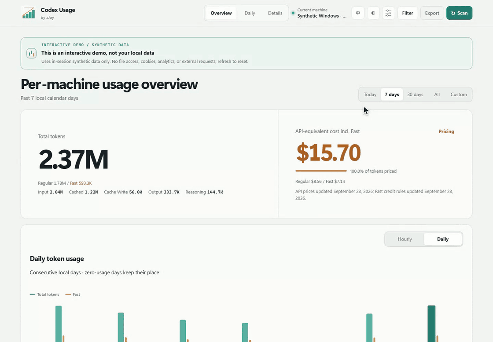
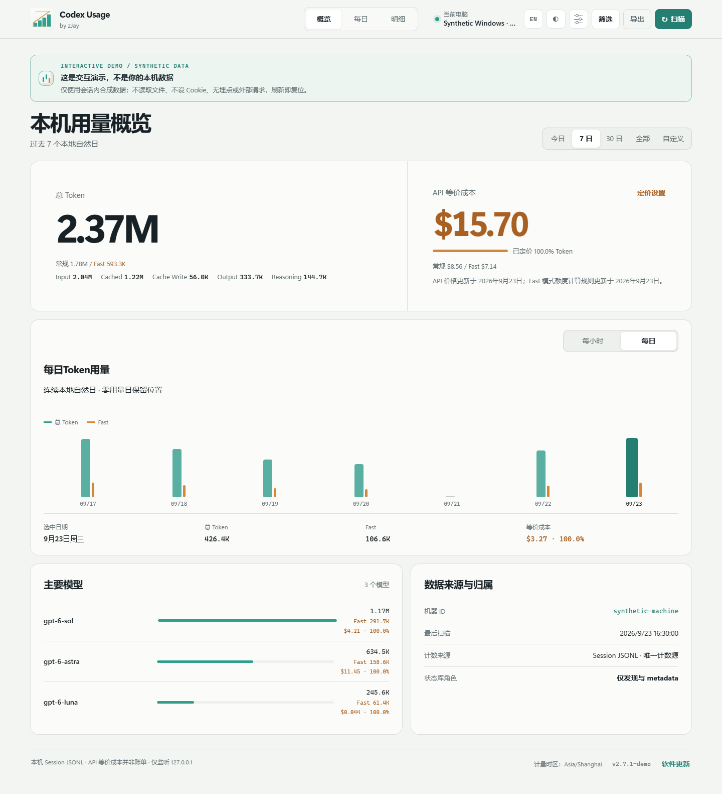
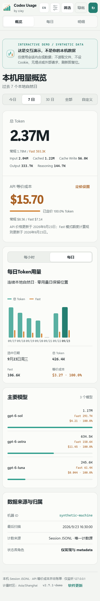
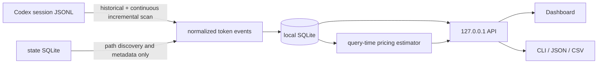

<div align="center">


<h1 align="center">Codex Usage<sub><sub><p align="right"><sup>by zJay</sup></p></sub></sub></h1>

**Your Codex usage, clear at a glance.**

*A complete, thoughtfully built local dashboard. From each computer to every task.*

[Live Demo](https://zjay26.github.io/codex-usage/?lang=en) · [Windows x64](https://github.com/zJay26/codex-usage/releases/latest/download/codex-usage-windows-amd64.exe) · [Linux x64](https://github.com/zJay26/codex-usage/releases/latest/download/codex-usage-linux-amd64) · [macOS Apple Silicon](https://github.com/zJay26/codex-usage/releases/latest/download/codex-usage-darwin-arm64) · [All downloads](#quick-start) · English / [简体中文](README.md)

[](https://github.com/zJay26/codex-usage/actions/workflows/ci.yml)
[](https://github.com/zJay26/codex-usage/releases/latest)
[](https://go.dev/)
[](LICENSE)

</div>

https://github.com/user-attachments/assets/a24e1a43-1948-4bca-9958-10d9975b570c



Overview → minute-precision time range → hourly drill-down → calendar → projects and task trees → search and Fast filters → JSON / CSV export → model pricing → themes and languages.

[Try the interactive demo](https://zjay26.github.io/codex-usage/?lang=en) · [High-resolution video](docs/media/codex-usage-demo-en.mp4) · [Promo film](docs/media/codex-usage-promo-en.mp4) ([vertical](docs/media/codex-usage-promo-en-vertical.mp4))

> Recorded directly from the current Dashboard with healthy, fully priced synthetic data. The online demo does not read your files, set cookies, run analytics, or make external requests.

## Quick start

**Just two steps: download the program for your computer, then run `install` once.**

It then organizes the Codex history already on your computer and keeps counting in the background. To check your usage later, open [http://127.0.0.1:43189](http://127.0.0.1:43189) in a browser. No database to set up, no account to create, and your data never leaves your computer.

### Step 1: Pick your version and download

Not sure which one you need? Match your computer to the table:

| Your computer | Download |
|---|---|
| Windows (most PCs) | [Windows x64](https://github.com/zJay26/codex-usage/releases/latest/download/codex-usage-windows-amd64.exe) |
| Windows ARM device (uncommon; Settings → System → About shows an ARM processor) | [Windows ARM64](https://github.com/zJay26/codex-usage/releases/latest/download/codex-usage-windows-arm64.exe) |
| Mac with Apple silicon (M1 / M2 / M3 / M4, etc.) | [macOS Apple Silicon](https://github.com/zJay26/codex-usage/releases/latest/download/codex-usage-darwin-arm64) |
| Mac with an Intel chip (Apple menu → About This Mac says “Intel”) | [macOS Intel](https://github.com/zJay26/codex-usage/releases/latest/download/codex-usage-darwin-amd64) |
| Linux / WSL (most computers) | [Linux x64](https://github.com/zJay26/codex-usage/releases/latest/download/codex-usage-linux-amd64) |
| Linux / WSL ARM device | [Linux ARM64](https://github.com/zJay26/codex-usage/releases/latest/download/codex-usage-linux-arm64) |

### Step 2: Run install

**Already downloaded it in your browser?** Open a terminal (PowerShell on Windows), go to the folder containing the file, and run `<file name> --lang en install`. On Windows, for example: `.\codex-usage-windows-amd64.exe --lang en install`. On Mac / Linux, first run `chmod +x <file name>` to make it executable, then `./<file name> --lang en install`.

**Want the shortcut?** Copy the commands for your system below and paste them into a terminal; they download and install in one go.

**Windows**: search for “PowerShell” in the Start menu, open it, and paste. No administrator privileges needed. For ARM64 devices, replace `amd64` with `arm64` in the URL:

```powershell
Invoke-WebRequest https://github.com/zJay26/codex-usage/releases/latest/download/codex-usage-windows-amd64.exe -OutFile codex-usage.exe
.\codex-usage.exe --lang en install
```

**macOS**: open Terminal (search for it in Launchpad) and paste. No `sudo` needed. This is the Apple Silicon version; for Intel, replace `arm64` with `amd64` in the URL:

```bash
curl -fL https://github.com/zJay26/codex-usage/releases/latest/download/codex-usage-darwin-arm64 -o codex-usage
chmod +x codex-usage
./codex-usage --lang en install
```

Run this from a normal macOS graphical login session; the service then starts automatically at login. The binary is not Apple Developer-ID signed or notarized, so macOS may block it on first run; see [macOS installation](docs/macos.md) for opening and verification steps. In an SSH-only session, use `./codex-usage serve` to run in the foreground.

**Linux / WSL**: open a terminal and paste. This is the x64 version; for ARM64 devices, replace `amd64` with `arm64` in the URL:

```bash
curl -fL https://github.com/zJay26/codex-usage/releases/latest/download/codex-usage-linux-amd64 -o codex-usage
chmod +x codex-usage
./codex-usage --lang en install
```

Login startup uses `systemd --user` by default. If that is unavailable, the installer starts the program in the background and prints a warning; automatic startup then needs manual configuration.

### Step 3: Open the Dashboard

When installation finishes, open [http://127.0.0.1:43189](http://127.0.0.1:43189) in your browser (only your own computer can open this address). If the installer prints a different address, use that one.

That's it: the program runs in the background, your history is organized, and new usage keeps updating automatically. From now on, just open that address to check.

## From the big picture to every task

**codex-usage is a complete local usage dashboard built for people who use Codex every day.** Totals, trends, costs, models, projects, and tasks come together in one clear interface. Start with the big picture, then follow a date, hour, model, or task to understand what drove consumption. It is useful on a single computer, and per-machine accounting keeps each host's usage clear when you share an account across devices.

Install once to index existing history and keep new usage up to date. **Go from “How much did I use today?” to “What did these 90 minutes, this project, or this task tree consume?” in the same interface.** Regular / Fast breakdowns, minute-precision ranges, Session search, combined filters, API-equivalent costs, and exports are all included. English and Chinese, light and dark themes, display settings, and a mobile layout make it comfortable to check every day.

One binary runs on Windows, Linux / WSL, or macOS, with no database service or central server to deploy. Statistics stay on the current computer; prompts, replies, and tool output are never stored, and `auth.json` is never read. Costs are estimates using bundled public API prices and Fast credit multipliers, not actual bills or account quotas.

## A complete toolkit for everyday use

| Capability | What you get |
|---|---|
| Totals and costs at a glance | Total tokens, Input / Cached / Cache Write / Output / Reasoning composition, API-equivalent costs, and pricing coverage |
| Custom time ranges | Today, 7 days, 30 days, all time, or any minute-precision interval; query across dates and see the unabridged total |
| Regular / Fast breakdowns | Total and Fast usage across overview, trends, models, and tasks; filter to Fast and estimate cost using supported credit multipliers |
| Daily and hourly drill-down | Trends, calendars, zero-usage days, hourly distribution, and model composition in one accounting timezone, including repeated DST hours |
| Multiple attribution views | Explore models, sources, projects, Threads, Sessions, and main tasks, Subagents, Guardians, or Memory |
| Main tasks and subtasks | Collapse explicit parent/child links; compare own and subtree usage while costs remain own-only |
| Search, filter, and export | Search task titles, Session IDs, projects, models, or sources; combine date, mode, and Agent filters, then export the current scope as JSON / CSV |
| Configurable model pricing | Bundled prices for GPT-6 Astra / Sol / Luna and more, internal-model aliases, and local rate overrides; unpriced usage stays explicit |
| Comfortable interface | English / Chinese, light / dark themes, font and density settings, reduced motion, and mobile layouts; tokens and costs follow the same filters |
| Per-machine accounting | View work and home computers, Windows / WSL / Linux / macOS hosts independently and locate each one's consumption |
| Continuous indexing and checks | Scan history and new records; handle duplicates, fork replays, and compaction requests; preserve statistics and ask before a required rebuild |
| Lightweight install and updates | Single binaries for six platform / architecture combinations, no external database, optional update checks, and user-controlled installation |
| Local and private | Data stays on the current computer, web assets are embedded, and no usage or conversations are uploaded to a central server |

## Scope and boundaries

| Counts | Does not count or store |
|---|---|
| Tokens, models, sources, projects, Threads, Sessions, Agents, and calendar days on this machine | Usage from other machines on the account |
| Existing and newly added local Codex session usage | Account quota, subscription balance, or real bills |
| API-equivalent cost using Standard text rates and Fast credit multipliers, plus pricing coverage | Prompts, replies, reasoning content, tool output, or `auth.json` |
| Data-quality notices for duplicates, resets, malformed records, and rebuilds | Cloud sync, remote telemetry, or third-party analytics |

> “Machine” means the host running Codex and codex-usage, not a remote target used by a shell or tool. Codex's official `/usage` shows account-level activity; codex-usage adds detailed attribution for the current computer.

<details><summary>View current desktop and mobile screenshots (synthetic data)</summary>





</details>

## How it works: technical details

`codex-usage` is one Go binary containing the JSONL scanner, SQLite store, local API, and Web Dashboard.

During an upgrade, the installer removes only a legacy OTel exporter marked by codex-usage itself. It never rewrites third-party exporters, and Codex does not need to restart.


```mermaid
flowchart LR
    A[Codex session JSONL] -->|historical + continuous incremental scan| C[normalized token events]
    S[state SQLite] -->|path discovery and metadata only| C
    C --> D[(local SQLite)]
    D --> P[query-time pricing estimator]
    D --> E[127.0.0.1 API]
    P --> E
    E --> F[Dashboard]
    E --> G[CLI / JSON / CSV]
```

### Historical scan

The tool reads the current machine's `CODEX_HOME`. It first discovers canonical session metadata from the Codex state database, then streams JSONL files under `sessions/` and `archived_sessions/`.

Modern logs use `token_usage_record`, deduplicated by thread and `response_id`, with `turn_token_usage` reconciled against the existing turn ledger. Both ordinary responses and compaction requests count. Legacy `token_count` notifications for the same turn only advance the legacy cursor, and embedded copies in compaction history are not added again. Cumulative recovery of missing request details marks timestamp attribution uncertain; unmatched legacy notifications warn that tail usage may be missing.

Older turns without independent response records retain cumulative differencing. A new turn whose `total_token_usage` equals `last_token_usage` starts a fresh baseline; continuations and repeated snapshots retain the prior baseline. Each event belongs to its timestamp's accounting calendar day, not the session's final update date. Uncertain boundaries remain visible. Old compactions without recorded usage cannot be reconstructed from context length. Request identities, stable event IDs and cursors keep rescans idempotent; large prompt, response, reasoning and tool-output records are skipped without storing their content.

The Codex state database is used only to discover rollout paths and enrich titles, projects, and other metadata. Its `tokens_used` value never changes token totals. OpenAI's [`account/usage/read`](https://learn.chatgpt.com/docs/app-server#7-token-usage-chatgpt) is service-backed account activity; this tool counts only current-machine local JSONL, so the scopes differ.

### JSONL deduplication and fork ownership

- The first `session_meta` fixes the owner session of a physical JSONL file; a copied parent `session_meta` cannot overwrite it.
- Copied parent history in a fork establishes a baseline without counting as new child usage. The scanner supports parent metadata before or after the copied history, and single-metadata formats, using the evidence available in each format to identify the child's start.
- Session counters retain a high-water mark; turn counters persist per-turn progress and deduplicate stable snapshot identities, counting only new usage after a restart or a copied file resumed mid-turn. A pre-upgrade session in a newly restored physical file requests a rebuild when old identities cannot safely prove the replay boundary.
- If a same-total snapshot corrects Cached Input, Cache Write, Reasoning, or another category, the original event is corrected instead of treating the snapshot as a duplicate.

### File and calendar stability

Every scan unions paths from the state database with `sessions/` and `archived_sessions/`, so a missing state row cannot hide a JSONL file. Ordinary Windows paths and `\\?\` extended paths normalize to one file. Truncation, a rewrite inside the scanned range, a newly completed fork-replay boundary, or a parser upgrade preserves the current statistics and requests a rebuild. Derived indexes are cleared only after confirmation in the Dashboard or an explicit `codex-usage scan --rebuild`, then rebuilt from the JSONL files that still exist. Data from deleted JSONL files may no longer be recoverable at that point.

An IANA accounting time zone is persisted in the database and shown in the footer. All processes and remote browsers use it. When v2.6 first opens a database without a saved zone, it uses `CODEX_USAGE_TIMEZONE` (for example, `Asia/Shanghai`) or detects the host zone if unset. Later system or process time-zone changes do not override the saved value. Upgrades preserve existing calendar labels; new events use the saved accounting zone. Hours use actual UTC start instants, keeping repeated DST hours distinct and allowing 23- or 25-hour days. Unverifiable cumulative boundaries, malformed records, invalid timestamps, and pending rebuilds remain visible. Stale file-rewrite or truncation warnings are removed after a later scan proves that the path has recovered.

Events, modes, counter progress and file offsets commit atomically per file. Database failures roll back and retry; incomplete JSONL tails, including prefixes before the type field, remain unconsumed.

**Upgrades do not automatically recalculate old history.** See [the v2.6 accounting contract](docs/accounting-v2.6.md) for history preservation, accounting rules, and regression coverage.

### Local service

The service scans once on startup, then checks only JSONL size and modification time every 30 seconds. It runs an incremental scan after a change and a fallback scan every 10 minutes. Dashboard reads use a separate read-only SQLite pool, so ingestion no longer queues every page query behind one connection. There is no central server or cross-machine sync.

The Dashboard has three first-level views: Overview, Daily, and Details. Overview defaults to the last seven accounting calendar days. Daily fills zero-usage dates and supports calendar and hourly drill-down. Details includes model, source, agent, project, and thread dimensions, plus a Session list/task-tree switch.

Select **Custom** in Overview, enter start and end times to the minute, and click **Query usage** to see total tokens, the exact total, and API-equivalent cost for that interval. **Now** fills the end time with the current minute; click Query usage to apply it. Inputs use the ledger's accounting timezone. The start is inclusive and the end is exclusive; editing inputs preserves the last queried results until you query again. Repeated DST minutes use their first occurrence, and nonexistent minutes return an error. The API accepts `since` / `until` as `YYYY-MM-DDTHH:mm` in the accounting timezone or RFC3339 with an explicit offset. The cost endpoint supports `fill_days=0` to skip filling zero-usage dates for unrestricted ranges.

The task tree uses only explicit parent metadata from JSONL or the Codex state database; fork lineage is shown separately. Pagination selects roots with their descendants. Ancestors outside the filter provide structure without adding usage. Each row's tokens and cost belong to that task; the token subtotal includes its entire subtree under the current filter. Adding every row's subtree subtotal would double-count descendants. Missing parents and cycles appear as detached roots with diagnostic labels.

Persistent data revisions and SQLite read snapshots keep Session rows and costs on the same data version; external pricing changes also invalidate caches. Search selects matching Sessions, then applies date, model, mode, and other filters consistently to tokens, costs, and exports. Session queries select a page and aggregate its events before joining metadata. See [query consistency and performance](docs/accounting-v2.6.md#query-consistency-and-performance) for measurement methods and local latency comparisons.

Display settings in the header use a more comfortable type scale by default and let you adjust font size, display density, color theme, interface motion, and language with an immediate preview. These preferences stay in the current browser and never change usage data or exports.

### API-equivalent cost

The Dashboard shows regular, Fast, and all tokens, with a mode filter. Raw Fast tokens are never multiplied. Fast cost uses Standard base rates multiplied by ChatGPT Codex credit factors: 2.5 for Astra, the GPT-5.6 family, and GPT-5.5; 2 for GPT-5.4. Models without a confirmed factor remain unpriced. History is classified only from explicit evidence for the same turn; unconfirmed usage is provisionally regular. See the [Fast accounting, backfill, and API guide (Chinese)](docs/fast-mode-accounting.md).

The estimator streams the normalized events that already passed source de-duplication and attribution filtering. It runs at query time, writes no cost data to SQLite, and leaves existing token totals unchanged. Arithmetic uses fixed-point nano-USD. Cached Input and Cache Write are removed from regular Input, and Reasoning is already included in Output, so neither is charged twice.

The bundled Standard text price catalog was updated on **2026-09-23**. All values are USD / 1M tokens:

| Model | Input | Cached | Cache Write | Output |
|---|---:|---:|---:|---:|
| [GPT-6 Astra](https://developers.openai.com/api/docs/models/gpt-6-astra) | 10.00 | 1.00 | 12.50 | 50.00 |
| [GPT-6 Sol](https://developers.openai.com/api/docs/models/gpt-6-sol) | 2.00 | 0.20 | 2.50 | 10.00 |
| [GPT-6 Luna](https://developers.openai.com/api/docs/models/gpt-6-luna) | 0.10 | 0.01 | 0.125 | 0.50 |
| [GPT-5.6 Sol](https://developers.openai.com/api/docs/models/gpt-5.6-sol) | 5.00 | 0.50 | 6.25 | 30.00 |
| [GPT-5.6 Terra](https://developers.openai.com/api/docs/models/gpt-5.6-terra) | 2.00 | 0.20 | 2.50 | 12.00 |
| [GPT-5.6 Luna](https://developers.openai.com/api/docs/models/gpt-5.6-luna) | 0.20 | 0.02 | 0.25 | 1.20 |
| [GPT-5.5](https://developers.openai.com/api/docs/models/gpt-5.5) | 5.00 | 0.50 | not published | 30.00 |
| [GPT-5.4](https://developers.openai.com/api/docs/models/gpt-5.4) | 2.50 | 0.25 | not published | 15.00 |
| [GPT-5.4 mini](https://developers.openai.com/api/docs/models/gpt-5.4-mini) | 0.75 | 0.075 | not published | 4.50 |
| [GPT-5.3-Codex](https://developers.openai.com/api/docs/models/gpt-5.3-codex) | 1.75 | 0.175 | not published | 14.00 |
| [GPT-5.2-Codex](https://developers.openai.com/api/docs/models/gpt-5.2-codex) | 1.75 | 0.175 | not published | 14.00 |

GPT-6 Astra/Sol/Luna and GPT-5.6 Cache Write use the official 1.25× regular Input rule. Local JSONL stores cumulative token activity and cannot reliably reconstruct the per-request boundaries used for API billing. The estimator uses the Standard base rates above, adjusts explicitly identified Fast usage, and does not infer long-context multipliers. The UI always shows estimated cost together with token pricing coverage; unknown models are never treated as zero-cost.

Internal models can be explicitly mapped to one built-in public model or assigned custom rates in the Dashboard. Overrides take effect without restarting:

```json
{
  "pricing_overrides": {
    "codex-auto-review": { "alias_of": "gpt-5.6-luna" },
    "internal-model": {
      "input_usd_per_million": "1.00",
      "cached_input_usd_per_million": "0.10",
      "cache_write_input_usd_per_million": "1.25",
      "output_usd_per_million": "6.00"
    }
  }
}
```

The loopback API exposes `GET /api/v1/sessions`, `GET /api/v1/session-tree`, `GET /api/v1/session-estimates`, `GET /api/v1/cost-estimate`, `GET /api/v1/pricing`, and `PUT /api/v1/pricing/overrides`. Pricing ships inside the binary; the running app never fetches price pages.

## Common commands

These examples use `codex-usage` as shorthand for a binary on `PATH`. Otherwise, use your system's full invocation shown above and append the arguments. Set CLI language with a global option, for example `codex-usage --lang en doctor`.

```text
codex-usage                         Open the Dashboard
codex-usage summary --since 7d     Show a 7-day summary
codex-usage summary --since 30d --json
codex-usage summary --since all --csv
codex-usage scan                    Incremental historical scan
codex-usage scan --rebuild          Rebuild historical scan data
codex-usage serve                   Run the local service in the foreground
codex-usage doctor                  Check paths, JSONL sources, and service
codex-usage config add-home PATH    Add another CODEX_HOME
codex-usage uninstall               Remove the app, keep the database
codex-usage uninstall --purge       Remove the app and local data
```

The Dashboard supports `?lang=en|zh-CN` and its header language button. The URL wins over the saved locale, followed by the browser locale. The CLI also supports the `CODEX_USAGE_LANG` environment variable. `--json` and `--csv` fields never change with language.

## Local data paths

| Data | Windows | Linux | macOS |
|---|---|---|---|
| Codex Home | `%USERPROFILE%\.codex` | `~/.codex` | `~/.codex` |
| codex-usage state | `%LOCALAPPDATA%\codex-usage` | `${XDG_DATA_HOME:-~/.local/share}/codex-usage` | `~/Library/Application Support/codex-usage` |
| Installed binary | `%LOCALAPPDATA%\Programs\codex-usage\codex-usage.exe` | `~/.local/bin/codex-usage` | `~/Library/Application Support/codex-usage/bin/codex-usage` |
| SQLite | `usage.sqlite` in the state directory | `usage.sqlite` in the state directory | `usage.sqlite` in the state directory |

`CODEX_HOME` selects the Codex source directory to read. `CODEX_USAGE_HOME` selects the tool's own dedicated state directory and installs its binary under that directory's `bin` folder. Windows and WSL should use separate statistics databases; sharing or synchronizing active state across systems or machines breaks per-machine attribution.

The macOS login item is `~/Library/LaunchAgents/com.zjay.codex-usage.plist`. `uninstall` removes the service and program while retaining statistics; only `uninstall --purge` also deletes the tool's statistics data.

`usage.sqlite` is created automatically when installation, service startup, scanning, or a query first opens the store, then persists in the state directory above. The embedded pure-Go SQLite driver requires no separately installed SQLite server, Python, Docker, or CGO. The current user only needs write access to the state directory and sufficient disk space. Prefer a local disk; do not place the active database on cloud-sync folders, network shares, or a directory written by multiple machines.

## Privacy boundaries

- never reads or parses `auth.json`
- never stores prompts, responses, reasoning, or tool output
- never stores a Codex account ID
- uses no CDN; frontend assets are embedded
- refuses to listen outside `127.0.0.1`
- never reads actual OpenAI billing or ChatGPT rate-limit/account quota; it only estimates API-equivalent cost for this machine, including the Fast adjustment
- embeds its pricing catalog and makes no external network request for estimation

Full local project paths and thread titles are retained for attribution, so JSON/CSV exports may contain that local metadata.

## Build from source

Go 1.26.x is required; CI and official Releases use **Go 1.26.8**. Build for the current platform on Linux / macOS:

```bash
go test ./...
CGO_ENABLED=0 go build -trimpath -o codex-usage ./cmd/codex-usage
```

Build all six targets:

```powershell
# Windows
.\scripts\build.ps1
```

```bash
# Linux (the script uses sha256sum)
bash scripts/build.sh
```

Both scripts run Go tests and produce six binaries plus `dist/SHA256SUMS`. On macOS, use the single-platform build above, or cross-build with the Bash script in an environment providing GNU `sha256sum`.

Dashboard tests (require Node.js / npm; CI uses Node.js 24):

```bash
npm ci
npx playwright install chromium
npm test
```

By default, `npm test` builds and launches a real Go binary in a temporary directory. Set `CODEX_USAGE_BIN` to reuse an existing build.

Regenerate README animations, videos, and screenshots with `npm run capture:media`, and the promo film with `npm run capture:promo`; see [media notes](docs/media/README.md) for dependencies, scenarios, and recording checks.

Current [CI](https://github.com/zJay26/codex-usage/actions/workflows/ci.yml) covers Go tests and vet on Windows, Linux, and macOS Apple Silicon, Linux concurrency checks, Dashboard tests, and one native macOS install/uninstall/reinstall cycle; merges to main also run six-target cross-builds. Release publication additionally repeats the native install checks three times on both macOS Apple Silicon and Intel.

See [the v2.6 technical and verification notes](docs/accounting-v2.6.md) for accounting regressions, task trees, remote time-zone charts, and performance evidence. [ACCEPTANCE.md](ACCEPTANCE.md) archives earlier releases. Read [CONTRIBUTING.md](CONTRIBUTING.md) before opening an issue and [SECURITY.md](SECURITY.md) for private vulnerability reporting.

## Known boundaries

- This release does not aggregate multiple machines; open each machine's Dashboard separately
- JSONL that is permanently deleted or damaged cannot be fabricated from state `tokens_used` or account usage
- historical sessions cannot be reliably split after users synchronize one Codex Home across machines
- Codex `total` is displayed as reported; it is not an actual bill or account-quota measurement. API-equivalent cost converts local tokens using the installed catalog and local overrides; prices do not automatically sync online

## License

[MIT](LICENSE) © Codex Usage contributors
