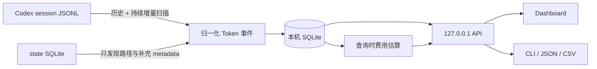

<div align="center">

# codex-usage

**同一个 Codex 账号：哪台电脑、哪个模型、哪个项目和会话用掉了 Token？**

*Which machine, model, project, or session used your Codex tokens?*

[在线体验](https://zjay26.github.io/codex-usage/?lang=zh-CN) · [Windows x64 下载](https://github.com/zJay26/codex-usage/releases/latest/download/codex-usage-windows-amd64.exe) · [Linux x64 下载](https://github.com/zJay26/codex-usage/releases/latest/download/codex-usage-linux-amd64) · [English](README.en.md) / 简体中文

[](https://github.com/zJay26/codex-usage/actions/workflows/ci.yml)
[](https://github.com/zJay26/codex-usage/releases/latest)
[](https://go.dev/)
[](LICENSE)

</div>


> 演示与在线 Demo 全部使用合成数据；不读取你的文件、不设 Cookie、无埋点或外部请求。

## 30 秒理解

如果你在多台电脑上使用 Codex，账号总量并不能告诉你：**究竟是哪台电脑、哪个项目、哪个模型或哪段 Session 用掉了 Token**。codex-usage 就是补上这张本机明细表。

每台电脑安装一次，之后打开浏览器就能查看总量、每日趋势、模型和项目分布；Session 明细可以直接搜索，并显示每段 Session 的 API 等价费用。页面会自动跟进本机后续产生的用量。

所有统计都留在当前电脑上；不保存 prompt、回复或工具输出，也不读取 `auth.json`。程序仅提取用量和模式元数据，跳过诊断记录中的对话字符串。费用按公开 API 单价及 Fast 额度倍率做等价估算，不是 OpenAI 账单或账号配额。

## 直接安装

Windows amd64 / x64（无需管理员权限）：

```powershell
Invoke-WebRequest https://github.com/zJay26/codex-usage/releases/latest/download/codex-usage-windows-amd64.exe -OutFile codex-usage.exe
.\codex-usage.exe install
```

Linux amd64 / x64：

```bash
curl -fL https://github.com/zJay26/codex-usage/releases/latest/download/codex-usage-linux-amd64 -o codex-usage
chmod +x codex-usage
./codex-usage install
```

macOS（Apple Silicon；Intel 将 `arm64` 改为 `amd64`）：

```bash
curl -fL https://github.com/zJay26/codex-usage/releases/latest/download/codex-usage-darwin-arm64 -o codex-usage
chmod +x codex-usage
./codex-usage install
```

通过用户 LaunchAgent 登录自启，无需 `sudo`。校验、数据位置及未公证程序的打开方式见 [macOS 安装说明](docs/macos.md)。

需要 arm64？从 [最新 Release](https://github.com/zJay26/codex-usage/releases/latest) 下载 `windows-arm64.exe` 或 `linux-arm64`。下载后可先用同页的 `SHA256SUMS` 校验。英文安装输出使用：

```text
codex-usage --lang en install
```

安装器会自动整理这台电脑已有的 Codex 使用记录，并在后台持续更新。安装完成后运行 `codex-usage` 即可打开 Dashboard。

从 **v2.5.0** 起，程序默认每 6 小时检查一次 GitHub 最新稳定版，只提示、不强制更新。页面底部的“软件更新”可查看发布说明、关闭自动检查或手动检查；点击“下载并更新”后才下载并校验 SHA256、备份程序和本机统计、替换并重启。新版本启动失败会尝试恢复旧程序和数据，备份保留在状态目录的 `.codex-usage-updates/run-*` 中。

**旧版本需要先手动下载并执行一次 `install`，之后即可在软件内选择更新。** 便携版和预览版只提供检查和发布页链接。更新检查只向 GitHub 请求版本信息，下载也来自本项目 Release，不上传用量、路径或对话；关闭自动检查后不会在后台请求更新信息。仍可随时通过重新执行 `install` 手动升级。

Linux 服务器没有桌面环境时，程序会打印 SSH 隧道命令。在自己的电脑执行命令后访问 `http://127.0.0.1:43189`。

## 你能看到什么

| 你想知道 | codex-usage 给出的视图 |
|---|---|
| 哪台电脑用了 Token？ | 每台 Windows、WSL、Linux 或 macOS 主机独立统计，不混入账号在其他电脑上的用量 |
| 用在了什么模型和内容类型？ | 模型及 Input、Cached、Cache Write、Output、Reasoning 构成 |
| 哪项工作驱动了用量？ | 项目、Thread、Session，以及主任务、Subagent、Guardian、Memory 归属 |
| 什么时候发生？ | 今天、7 日、30 日、全部历史，以及按自然日查看详情 |
| 某段 Session 花了多少？ | Session 级 Token 与 API 等价费用；可搜索，也可一键只看当前 Session |
| 如果全部按 API 价格折算呢？ | 总体与分项的 API 等价费用，并明确显示有多少 Token 能够定价 |

## 功能亮点

| 功能 | 你得到什么 |
|---|---|
| 逐电脑归属 | 每台电脑独立统计，清楚区分公司电脑、家用电脑、Windows、WSL、Linux 或 macOS |
| 历史与增量同步 | 安装后先整理已有记录，后续用量自动进入 Dashboard |
| 可选软件更新 | 自动检查并提示新版本，由用户选择下载和安装，也可关闭自动检查 |
| 总量与 Fast | 以总 Token 为主，概览下方显示常规 / Fast 拆分；趋势、模型和任务同时显示总量与 Fast |
| 主任务与子任务树 | 折叠查看明确父子关系，区分本任务与含子任务用量；费用列仅计本任务 |
| Session 搜索与筛选 | 按 Thread、Session ID、项目、模型或来源搜索；快捷筛选再次点击即可取消 |
| 每日下钻 | 查看连续趋势、月历、零用量日和任意一天的模型构成 |
| 多维明细 | 按模型、Token 类型、来源、项目、Thread、Session 和 Agent 理解用量 |
| 等价费用 | 总览和 Session 都显示 API 等价费用；无法定价的部分会明确标出，不会假装免费 |
| 本地与隐私 | 数据只留在当前电脑，不上传对话，也不依赖中心服务器 |
| 轻量部署 | Windows / Linux / macOS、amd64 / arm64 都是单文件程序，无需另装数据库 |
| 中英双语 | Dashboard 与 CLI 都可切换简体中文或 English |

## 范围与边界

| 会统计 | 不会统计或保存 |
|---|---|
| 当前电脑的 Token、模型、来源、项目、Thread、Session、Agent 和自然日 | 账号在其他电脑上的用量 |
| 本机已有以及之后新增的 Codex session 用量记录 | 账号配额、订阅余额或真实账单 |
| 按 Standard API 文本价格与 Fast 额度倍率折算的费用和定价覆盖率 | prompt、回复、reasoning 内容、工具输出或 `auth.json` |
| 重复、回退、坏记录和文件重建等数据质量提示 | 云同步、远程遥测或第三方分析 |

> “电脑”指运行 Codex 客户端和 codex-usage 的主机，不是 shell 或 tool 实际执行的远程环境。Codex 官方 `/usage` 查看账号级活动；codex-usage 补充当前电脑上的详细归属。

<details><summary>查看静态桌面和 390 × 844 移动端截图</summary>


</details>

## 工作原理与技术说明

`codex-usage` 是一个 Go 单文件程序，里面同时包含 JSONL 扫描器、SQLite、HTTP API 和 Web Dashboard。安装后，它以用户级后台服务运行。

升级时，安装器只会移除旧版由 codex-usage 自己标记的 OTel exporter，不会改写第三方 exporter，也无需重启 Codex。



### 1. 历史扫描

程序只读当前电脑的 `CODEX_HOME`。它优先从 Codex 状态库取得 session 路径、项目和 Thread 信息，再流式读取 `sessions/` 与 `archived_sessions/` 中的 JSONL。

Token 记录可能按 Session 累计，也可能按 Turn 累计。扫描器保存计量范围与上次 Token 所属 Turn；新 Turn 的 `total_token_usage` 与 `last_token_usage` 相等时建立 Turn 范围，数值小于、等于或大于上一 Turn 均重新起算。旧版 Session 累计仍保留跨 Turn 基线。程序在**每一条** `token_count` 记录处保存累计向量，用“本次累计值 - 上次累计值”得到这一次的增量，并把增量归到该条记录时间戳对应的本地自然日；不会按 session 的最后更新时间把整段历史塞到同一天。重复扫描仍由稳定事件 ID 与游标去重。超大的 prompt、回复和工具输出记录会被跳过，不会整行载入内存，也不会写进数据库。

Codex 状态库只用于发现 rollout 路径并补充标题、项目等 metadata；其中的 `tokens_used` 不参与 Token 总量。OpenAI 的 [`account/usage/read`](https://learn.chatgpt.com/docs/app-server#7-token-usage-chatgpt) 是服务端账号 Token 活动；本工具只统计当前电脑的本地 JSONL，两者范围不同。

### 2. JSONL 防重与 fork 识别

- 一个物理 JSONL 的 owner session 由第一条 `session_meta` 固定，后续复制进来的父 `session_meta` 不会改写归属
- `forked_from_id` 文件中“子线程 metadata → 父线程历史快照 → 父线程 metadata”这一前缀只建立累计基线，不计作子线程新消耗
- Session 范围保留累计高水位；Turn 范围按任务与 Turn 的稳定快照标识排重。升级前 Session 出现在新的物理文件、旧标识无法安全核对时保留统计并提示重建
- `total_tokens` 不变但 Cached Input、Cache Write、Reasoning 等分类被修正时，会修正原事件，而不是当作重复忽略

### 3. 文件与日期稳定性

扫描器每次都用状态库路径与 `sessions/`、`archived_sessions/` 目录取并集，避免状态库漏行。Windows 普通路径与 `\\?\` 扩展路径会归一为同一物理文件。检测到截断、原范围重写、后补出的 fork 重放边界或解析规则升级时，程序会保留现有统计并提示需要重建；只有用户在 Dashboard 明确确认，或显式运行 `codex-usage scan --rebuild` 后，才会清除派生索引并从当前仍存在的全部 JSONL 重建。已删除 JSONL 对应的数据届时可能无法恢复。

计量时区以 IANA 名称保存在数据库，所有进程与远程浏览器使用同一时区；页脚显示当前时区。每个事件保留自然日标签，小时用真实 UTC 起点标识，夏令时重复小时不会合并。首次创建数据库前可设置 `CODEX_USAGE_TIMEZONE`，之后更改系统或进程时区不改变该库的计量时区。新版 Codex 在新 Turn 开始时重置累计值，但当该值与 `last_token_usage` 完全一致时，扫描器会把它作为精确增量处理，不再误报数据质量问题。真正无法完整核对的累计边界、坏记录、无效时间戳和待确认重建仍会明确提示；文件改写或截断问题经后续扫描确认恢复后，过时的红色提示会自动消除。

事件、模式、累计进度与文件游标按文件原子提交；写入失败整笔回滚并保留重试位置。未完整写入的 JSONL 尾行不会提前消费，包括尚未写到 `type` 字段的前缀。

**v2.6.0 升级保留旧账，修复适用于新增记录。** 旧版本已经漏计的历史需在核对源文件覆盖并备份后显式重算；不会因升级自动删除旧统计。查询快照、搜索范围、任务树和性能证据见 [v2.6 技术说明](docs/accounting-v2.6.md)。

### 4. 展示与服务

后台服务启动时先扫描一次，之后每 30 秒只检查 JSONL 的文件大小与修改时间；检测到变化才执行增量扫描，无变化时每 10 分钟兜底扫描。Dashboard 使用独立只读连接查询同一个本机 SQLite，扫描写入不会再把页面查询堵在单一连接后。没有任何中心服务器，也没有跨电脑同步；要看两台电脑，就分别打开两台电脑的 Dashboard。

Dashboard 固定为“概览 / 每日 / 明细”三个一级视图。概览默认显示最近 7 个本地自然日；每日视图补齐零用量日期并支持月历下钻；明细视图一次只展开模型、来源、Agent、项目或 Thread 中的一个维度。

页头“显示设置”默认采用更舒适的字号层级，并可即时调整字体大小、显示密度、颜色主题、界面动效和语言。所有显示偏好只保存在当前浏览器，不会影响统计数据或导出结果。

### 5. API 等价成本

Dashboard 展示常规、Fast 和全部 token，并提供模式筛选。Fast 原始 token 不乘倍率；费用按 Standard 基价乘 ChatGPT Codex 额度倍率：Astra、GPT-5.6 系列、GPT-5.5 为 2.5 倍，GPT-5.4 为 2 倍。未知倍率的型号保留为未定价。历史模式仅凭同一 turn 的明确证据补齐，未确认部分暂归常规。详见 [Fast 模式口径、历史补齐与接口说明](docs/fast-mode-accounting.md)。

费用在查询时流式读取已经过去重、归属规则筛选后的规范事件，不写入 SQLite，也不会改变原有 Token 统计。计算使用定点 nano-USD：Cached Input 与 Cache Write 从 Input 中扣除，Reasoning 已包含在 Output 中，不会重复收费。

内置 Standard 文本价格目录更新于 **2026-09-05**，单位均为 USD / 1M Token：

| 模型 | Input | Cached | Cache Write | Output |
|---|---:|---:|---:|---:|
| [GPT-6 Astra](https://developers.openai.com/api/docs/models/gpt-6-astra) | 10.00 | 1.00 | 12.50 | 50.00 |
| [GPT-5.6 Sol](https://developers.openai.com/api/docs/models/gpt-5.6-sol) | 5.00 | 0.50 | 6.25 | 30.00 |
| [GPT-5.6 Terra](https://developers.openai.com/api/docs/models/gpt-5.6-terra) | 2.00 | 0.20 | 2.50 | 12.00 |
| [GPT-5.6 Luna](https://developers.openai.com/api/docs/models/gpt-5.6-luna) | 0.20 | 0.02 | 0.25 | 1.20 |
| [GPT-5.5](https://developers.openai.com/api/docs/models/gpt-5.5) | 5.00 | 0.50 | 未公开 | 30.00 |
| [GPT-5.4](https://developers.openai.com/api/docs/models/gpt-5.4) | 2.50 | 0.25 | 未公开 | 15.00 |
| [GPT-5.4 mini](https://developers.openai.com/api/docs/models/gpt-5.4-mini) | 0.75 | 0.075 | 未公开 | 4.50 |
| [GPT-5.3-Codex](https://developers.openai.com/api/docs/models/gpt-5.3-codex) | 1.75 | 0.175 | 未公开 | 14.00 |
| [GPT-5.2-Codex](https://developers.openai.com/api/docs/models/gpt-5.2-codex) | 1.75 | 0.175 | 未公开 | 14.00 |

GPT-6 Astra 和 GPT-5.6 的 Cache Write 使用官方“普通 Input 的 1.25 倍”规则。本机 JSONL 保存的是累计 Token 活动，不能可靠还原 API 账单中的逐请求边界；估算采用上表 Standard 基价，并对明确 Fast 的用量折算，不推断长上下文倍率。页面始终同时展示费用和 Token 定价覆盖率，未知模型不会被当成零费用。

内部模型可以在 Dashboard 的“定价设置”中映射到一个明确的内置公开模型，或填写自定义单价。等价配置如下，保存后无需重启：

```json
{
  "pricing_overrides": {
    "codex-auto-review": { "alias_of": "gpt-5.6-luna" },
    "internal-model": {
      "input_usd_per_million": "1.00",
      "cached_input_usd_per_million": "0.10",
      "cache_write_input_usd_per_million": "1.25",
      "output_usd_per_million": "6.00"
    }
  }
}
```

本机 API 提供 `GET /api/v1/cost-estimate`、`GET /api/v1/pricing` 和 `PUT /api/v1/pricing/overrides`。价格随二进制嵌入，运行时不会抓取网页。

## 常用命令

```text
codex-usage                         打开 Dashboard
codex-usage summary --since 7d     查看近 7 日摘要
codex-usage summary --since 30d --json
codex-usage summary --since all --csv
codex-usage scan                    增量扫描
codex-usage scan --rebuild          重建历史扫描数据
codex-usage doctor                  检查路径、JSONL 来源和服务
codex-usage config add-home PATH    添加额外 CODEX_HOME
codex-usage uninstall               卸载程序，保留统计库
codex-usage uninstall --purge       卸载并删除统计数据
```

Dashboard 支持 `?lang=en|zh-CN` 和页头语言按钮；URL 参数优先于已保存语言，其次跟随浏览器。CLI 支持全局 `--lang` 和 `CODEX_USAGE_LANG`，例如 `CODEX_USAGE_LANG=en codex-usage doctor`。`--json` 与 `--csv` 字段不随语言改变。

## 数据存在哪里

| 内容 | Windows | Linux | macOS |
|---|---|---| --- |
| Codex Home | `%USERPROFILE%\.codex` | `~/.codex` | `~/.codex` |
| codex-usage 状态 | `%LOCALAPPDATA%\codex-usage` | `${XDG_DATA_HOME:-~/.local/share}/codex-usage` | `~/Library/Application Support/codex-usage` |
| 安装后的程序 | `%LOCALAPPDATA%\Programs\codex-usage\codex-usage.exe` | `~/.local/bin/codex-usage` | `.../codex-usage/bin/codex-usage` |
| SQLite | `...\codex-usage\usage.sqlite` | `.../codex-usage/usage.sqlite` | `.../codex-usage/usage.sqlite` |

设置 `CODEX_USAGE_HOME` 可以覆盖工具自己的状态目录。不要在多台电脑之间同步这个目录，否则逐电脑边界会失真。

`usage.sqlite` 会在首次安装、启动服务、扫描或查询需要打开状态库时自动创建，并持续保存在上述状态目录。程序使用内嵌的纯 Go SQLite 驱动，不要求预装 SQLite、数据库服务、Python、Docker 或 CGO；只需要当前用户对状态目录有读写权限，并有足够磁盘空间。应优先使用本机磁盘，不建议把活动数据库放在网盘、网络共享或多台电脑共同写入的同步目录。

## 隐私边界

`codex-usage` 的边界是刻意收紧的：

- 不读取或解析 `auth.json`
- 不保存 prompt、回复、reasoning 或工具输出
- 不保存 Codex 账号 ID
- 不使用 CDN，页面资源全部离线内嵌
- 不监听 `127.0.0.1` 以外的地址
- 不读取 OpenAI 真实账单或 ChatGPT rate-limit / 账号配额；只提供当前电脑的 API 等价成本估算（含 Fast 折算）
- 定价目录随二进制嵌入，运行时不会为费用功能访问外部网络

本机完整项目路径和 Thread 标题会用于归属视图，因此导出的 JSON/CSV 也可能包含这些本机信息。

## 从源码构建

需要 Go 1.26.x：

```bash
go test ./...
CGO_ENABLED=0 go build -trimpath -o codex-usage ./cmd/codex-usage
```

构建全部平台：

```powershell
# Windows
.\scripts\build.ps1
```

```bash
# Linux
./scripts/build.sh
```

Dashboard 测试：

```bash
npm ci
npx playwright install chromium
npm test
```

`npm test` 默认在临时目录构建并启动真实 Go 二进制；设置 `CODEX_USAGE_BIN` 可以复用已有构建产物。

更多验收数据见 [ACCEPTANCE.md](ACCEPTANCE.md)。问题反馈前请阅读 [CONTRIBUTING.md](CONTRIBUTING.md)；涉及本机数据或路径的安全问题请按 [SECURITY.md](SECURITY.md) 私密报告。

## 已知边界

- 当前版本不做跨电脑聚合；每台机器独立查看
- JSONL 若被外部工具永久删除或损坏，缺失部分无法由 state `tokens_used` 或账号用量伪造补回
- 主动同步同一个 Codex Home 后，安装前的历史无法可靠拆回原始电脑
- `total` 按 Codex 原始值展示，不等于独立生成文字量、真实账单或账号配额；API 等价成本只是按当前价格对本机 Token 的重新折算

## License

[MIT](LICENSE) © Codex Usage contributors
