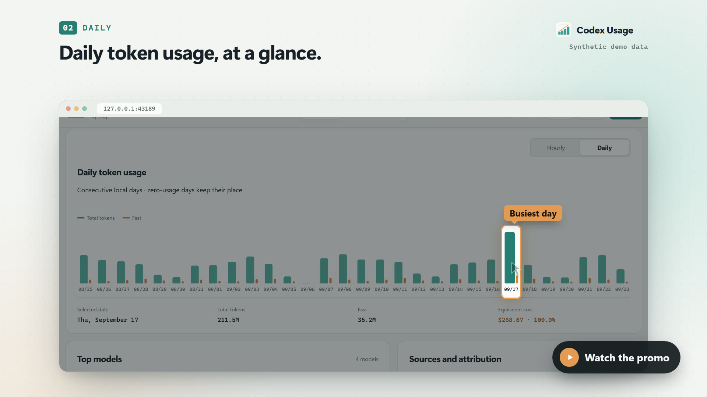

# README media

The Chinese and English tours use the actual Dashboard with the in-memory synthetic API in `scripts/demo-api.js`. The default fixture has no data-quality warnings and uses fully priced GPT-6 Sol, Astra, and Luna records. No warning UI is hidden or removed. Append `&scenario=diagnostics` to the demo URL to exercise the separate incomplete-data fixture and its warning dialog.

## Reproduce

Install the repository's Node dependencies, Playwright Chromium, and FFmpeg / ffprobe on `PATH`, then run:

```sh
npm ci
npx playwright install chromium
npm run capture:media
```

`PLAYWRIGHT_CHANNEL` optionally selects an installed browser. `MEDIA_LOCALE=zh-CN` or `MEDIA_LOCALE=en` records one language when iterating. Capture launches its own loopback static server on a free port and stops it on completion; it never opens the local usage database.

Outputs:

- `codex-usage-demo.gif` and `codex-usage-demo-en.gif`: complete 1120 × 778 tours, with up to 20 fps motion and held static frames, for each README.
- `codex-usage-demo-zh.mp4` and `codex-usage-demo-en.mp4`: 1440 × 1000, 25 fps video alternatives.
- `social-preview.png` and `../images/dashboard*.png`: refreshed social, desktop, and mobile images.
- `../../dist/media-review/<locale>/`: ignored chapter screenshots and `chapters.json` with actual timing and recording checks.

The tour covers overview ranges, minute-precision queries, hourly drill-down, daily calendar, projects, expandable task trees, Session search, Fast filtering, JSON / CSV export, model prices, themes, and languages. Pointer movement takes 160–340 ms with easing; most results remain visible for 350–850 ms. There is no global time compression and no truncated tail. Capture fixes the clock and timezone for reproducible dates, waits for pricing before recording, and checks the entire tour for visible warning/error banners, JavaScript errors, and external requests.

The export dialog is demonstrated without downloading files. Software installation and updates are documented in the project README; the synthetic demo does not install software.

## Promo film

`npm run capture:promo` renders a 53-second promotional film in Chinese and English, in landscape and vertical cuts:

- `codex-usage-promo-zh.mp4` and `codex-usage-promo-en.mp4`: 1920 × 1080, 30 fps, H.264 + AAC.
- `codex-usage-promo-zh-vertical.mp4` and `codex-usage-promo-en-vertical.mp4`: 1080 × 1920 for short-video platforms.
- `codex-usage-promo-poster.jpg` and `codex-usage-promo-poster-en.jpg`: landscape posters with a play badge.

[](codex-usage-promo-en.mp4)

The film opens with a question and the brand, then shows ten features, one idea per shot:

1. Totals and cost
2. The last 30 days of daily usage
3. Hourly usage
4. A minute-precision range since the last reset
5. The calendar with its Standard / Fast split
6. Breakdowns by model and project
7. Session search
8. The task tree
9. Export, live usage updates, and software updates
10. Theme, language, and mobile layout

It closes with the privacy promise and install instructions.

Each shot uses the same devices. The camera settles on one area, the rest of the page dims, a label names what matters, and a cursor performs the click that leads to the next still.

The film uses its own synthetic ledger, `?scenario=promo` in `scripts/demo-api.js`, with heavier, more realistic use than the default demo:

- About 2.38B tokens and $3,100 of API-equivalent cost over 30 days.
- A weekday rhythm, a release-day spike, and idle Sundays.
- Seven projects and task-like Session titles in the viewer's language.
- Subagent trees and a mock "update available" state.

The default online demo and its tests are unchanged.

The pipeline has three steps, all offline:

1. `scripts/promo/assets.mjs` captures 2× Dashboard stills for every beat, together with the rectangles that the camera, spotlight, labels, and cursor are anchored to. The portrait cut uses a 1000 × 1150 Dashboard viewport so the panel fills the frame. The demo notice banner is left out of the stills; the film carries its own "synthetic demo data" label instead.
2. `scripts/promo/promo.html`, `promo.css`, and `promo.js` compose the scenes from a beat sheet. Every frame is a pure function of time, so `scripts/capture-promo.mjs` seeks frame by frame and pipes lossless screenshots into FFmpeg. There is no real-time recording, dropped frames, or timing drift.
3. `scripts/promo/music.mjs` synthesizes the soundtrack in Node (pads, bass, drums, plucks, bells, and whooshes), then normalizes it to −16 LUFS with FFmpeg's two-pass `loudnorm`. The soundtrack is generated, so it carries no licensing obligations.

`scripts/promo/timeline.json` is the single source of scene timing for both picture and sound. Several environment variables help when rendering or iterating:

- `MEDIA_LOCALE=zh-CN|en` and `PROMO_FORMAT=landscape|vertical` render a single version.
- `PROMO_PREVIEW=1` writes only one review still per second, plus the posters.
- `PROMO_ASSETS=<dir>` caches the captured stills between runs.

Rendering checks each MP4's resolution, frame count, duration, audio stream, and size. Review stills and `render.json` are written to `../../dist/promo-review/`.

The copy uses system fonts, the same as the Dashboard. Segoe UI Variable and Microsoft YaHei were used for the committed renders, so other systems may show slightly different typography.
